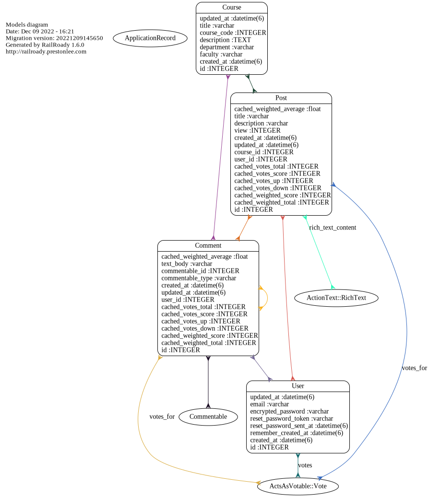

# README

- Heroku Link: https://sheltered-sierra-81845.herokuapp.com/ (Currently down)
- Please run:
```
  bundle config set --local without production
  bundle install
  rails db:migrate
  rails db:seed
```
- Project Kanban Board Link: https://github.com/users/jpaints3/projects/1

## UML Diagrams
- Models

- Controllers


## UI template Credits
  - Landing Page Template https://cruip.com/demos/solid/
  - Courses grid Ui https://codepen.io/oliviale/pen/bOWqbj
